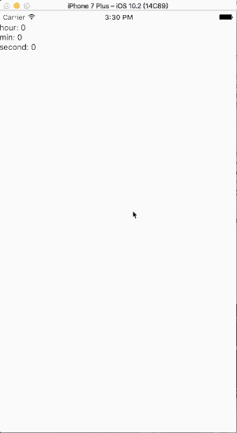

# rn-timer

## Description
通用定时器组件，子控件可以自定义，由`Timer`来控制计时器的相关功能


## Install
`npm install rn-timer --save`


## Props
```javascript
timestamp: PropTypes.number.isRequired, // 未来的某个时间戳(计时结束时间戳)
timerStep: PropTypes.number, // 计时器 step, 当前默认单位是 s
timerUnit: PropTypes.number, // 计时器 unit  not in use yet
binders: PropTypes.object, // 值映射对
timerFinishedListener: PropTypes.func, // 计时器计时结束的回调
```


## Usage
Class `TimerExample`

```javascript
export default class TimerExample extends Component {
  render() {
    const binder = { // 值-func 映射
      hour: (date: Date) => date.getUTCHours(),
      min: (date: Date) => date.getMinutes(),
      second: (date: Date) => date.getSeconds(),
    };

    return (
      <Timer
        timerStep={10}
        binders={binder}
        timestamp={new Date().getTime() + 50000}
        timerFinishedListener={() => {
          alert('end')
        }}>

		 // your cusotmer Timer Component
        <TimerUI/>

      </Timer>
    );
  }
}

```


class `TimerUI`

```javascript
import React, {Component} from 'react';
import { StyleSheet,  Text,  View} from 'react-native';

export default class TimerUI extends Component {

  static propTypes: {
    hour: React.PropTypes.number,
    min: React.PropTypes.number,
    second: React.PropTypes.number,
  }

  render() {
    const {hour, min, second} = this.props

    return (
      <View style={{marginTop: 20, flexDirection: 'column'}}>
        <Text>
          {`hour: ${hour}`}
        </Text>
        <Text>
          {`min: ${min}`}
        </Text>
        <Text>
          {`second: ${second}`}
        </Text>
      </View>
    );
  }
}

```





